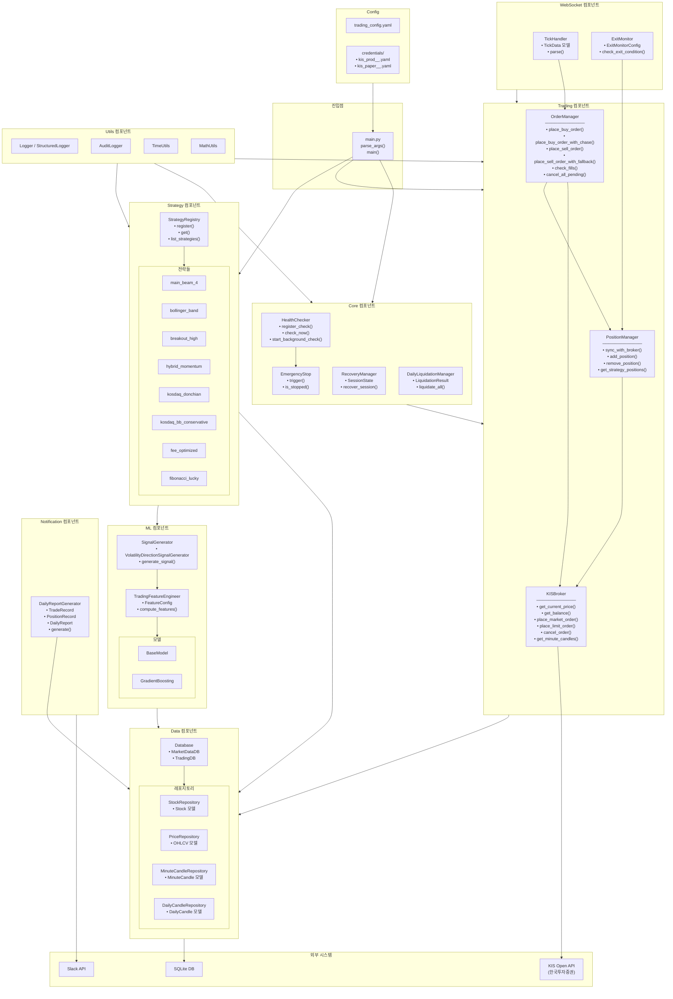
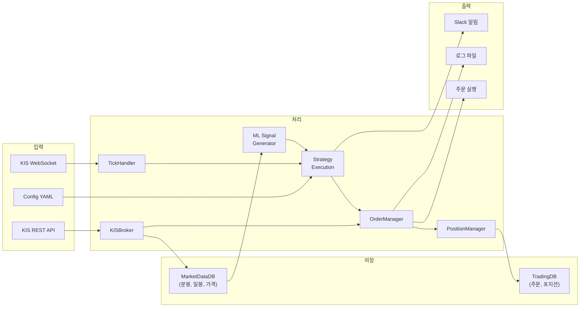
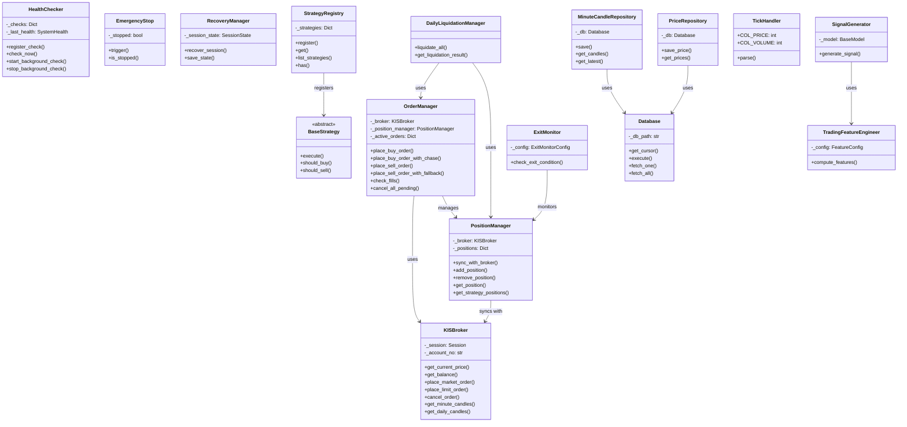
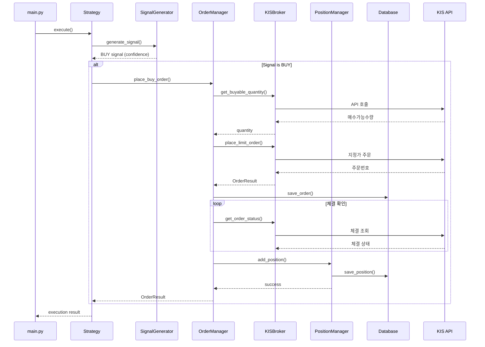
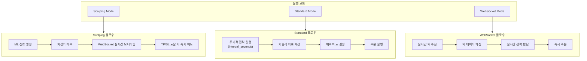

# Leverage Worker 아키텍처

> 주식 자동매매 시스템의 컴포넌트 단위 아키텍처 문서

## 1. 시스템 전체 구조



## 2. 데이터 흐름도



## 3. 클래스 관계도



## 4. 시퀀스 다이어그램 - 매수 플로우



## 5. 실행 모드별 흐름



## 6. 폴더 구조

```
leverage_worker/
├── main.py                      # 진입점
├── config/
│   ├── trading_config.yaml      # 매매 설정
│   └── credentials/             # KIS 인증 정보
│       ├── kis_prod__.yaml
│       └── kis_paper__.yaml
├── core/
│   ├── health_checker.py        # 상태 모니터링
│   ├── emergency.py             # 긴급 정지
│   ├── recovery_manager.py      # 세션 복구
│   └── daily_liquidation.py     # 당일 청산
├── trading/
│   ├── broker.py                # KIS API 통신 (1,183 lines)
│   ├── order_manager.py         # 주문 관리 (1,503 lines)
│   └── position_manager.py      # 포지션 관리 (606 lines)
├── strategy/
│   ├── registry.py              # 전략 레지스트리
│   └── strategies/
│       ├── main_beam_4.py       # ML 기반 (활성)
│       ├── bollinger_band.py
│       ├── breakout_high.py
│       ├── hybrid_momentum.py
│       └── ...
├── data/
│   ├── database.py              # SQLite 연결
│   ├── minute_candle_repository.py
│   ├── daily_candle_repository.py
│   ├── price_repository.py
│   └── stock_repository.py
├── websocket/
│   ├── tick_handler.py          # 실시간 틱
│   └── exit_monitor.py          # TP/SL 모니터
├── ml/
│   ├── signal_generator.py      # 신호 생성
│   ├── features.py              # 피처 엔지니어링
│   └── models/
│       ├── base_model.py
│       └── gradient_boosting.py
├── notification/
│   └── daily_report.py          # Slack 리포트
└── utils/
    ├── logger.py
    ├── structured_logger.py
    ├── audit_logger.py
    ├── time_utils.py
    └── math_utils.py
```

## 7. 컴포넌트 상세 설명

### Core 컴포넌트
| 클래스 | 파일 | 주요 메서드 | 역할 |
|--------|------|-------------|------|
| `HealthChecker` | [health_checker.py](../leverage_worker/core/health_checker.py) | `register_check()`, `check_now()`, `start_background_check()` | API, DB, Scheduler 상태 모니터링 |
| `EmergencyStop` | [emergency.py](../leverage_worker/core/emergency.py) | `trigger()`, `is_stopped()` | 긴급 정지 핸들러 |
| `RecoveryManager` | [recovery_manager.py](../leverage_worker/core/recovery_manager.py) | `recover_session()`, `save_state()` | 세션 복구/재연결 |
| `DailyLiquidationManager` | [daily_liquidation.py](../leverage_worker/core/daily_liquidation.py) | `liquidate_all()` | 당일 청산 처리 |

### Trading 컴포넌트
| 클래스 | 파일 | 주요 메서드 | 역할 |
|--------|------|-------------|------|
| `KISBroker` | [broker.py](../leverage_worker/trading/broker.py) | `get_current_price()`, `place_limit_order()`, `cancel_order()` | KIS API 통신 추상화 (1,000+ lines) |
| `OrderManager` | [order_manager.py](../leverage_worker/trading/order_manager.py) | `place_buy_order_with_chase()`, `place_sell_order_with_fallback()` | 주문 생명주기 관리 (1,500+ lines) |
| `PositionManager` | [position_manager.py](../leverage_worker/trading/position_manager.py) | `sync_with_broker()`, `add_position()`, `get_strategy_positions()` | 포지션 상태 관리 |

### Strategy 컴포넌트
| 클래스 | 파일 | 역할 |
|--------|------|------|
| `StrategyRegistry` | [registry.py](../leverage_worker/strategy/registry.py) | 전략 등록/조회 (싱글톤 패턴) |
| `main_beam_4` | strategies/ | ML 기반 4분 보유 전략 (승률 86.78%) |
| `hybrid_momentum` | strategies/ | 하이브리드 모멘텀 전략 |
| `bollinger_band` | strategies/ | 볼린저밴드 전략 |
| `breakout_high` | strategies/ | 고점 돌파 전략 |
| `kosdaq_*` | strategies/ | 코스닥 전용 전략들 |

### Data 컴포넌트
| 클래스 | 파일 | 데이터 | 역할 |
|--------|------|--------|------|
| `Database` | [database.py](../leverage_worker/data/database.py) | SQLite | 기본 DB 연결/쿼리 |
| `MarketDataDB` | [database.py](../leverage_worker/data/database.py) | 시장 데이터 | 가격/캔들 저장 |
| `TradingDB` | [database.py](../leverage_worker/data/database.py) | 거래 데이터 | 주문/포지션 저장 |
| `MinuteCandleRepository` | [minute_candle_repository.py](../leverage_worker/data/minute_candle_repository.py) | 분봉 | OHLCV 분봉 데이터 |
| `DailyCandleRepository` | [daily_candle_repository.py](../leverage_worker/data/daily_candle_repository.py) | 일봉 | OHLCV 일봉 데이터 |
| `PriceRepository` | [price_repository.py](../leverage_worker/data/price_repository.py) | 현재가 | 실시간 가격 |

### WebSocket 컴포넌트
| 클래스 | 파일 | 주요 메서드 | 역할 |
|--------|------|-------------|------|
| `TickHandler` | [tick_handler.py](../leverage_worker/websocket/tick_handler.py) | `parse()` | 실시간 틱 데이터 파싱 |
| `ExitMonitor` | [exit_monitor.py](../leverage_worker/websocket/exit_monitor.py) | `check_exit_condition()` | 실시간 TP/SL 모니터링 |

### ML 컴포넌트
| 클래스 | 파일 | 주요 메서드 | 역할 |
|--------|------|-------------|------|
| `SignalGenerator` | [signal_generator.py](../leverage_worker/ml/signal_generator.py) | `generate_signal()` | 변동성 방향 신호 생성 |
| `TradingFeatureEngineer` | [features.py](../leverage_worker/ml/features.py) | `compute_features()` | 피처 엔지니어링 |
| `GradientBoosting` | models/ | `predict()` | 그래디언트 부스팅 모델 |

### Notification 컴포넌트
| 클래스 | 파일 | 주요 메서드 | 역할 |
|--------|------|-------------|------|
| `DailyReportGenerator` | [daily_report.py](../leverage_worker/notification/daily_report.py) | `generate()` | Slack 일일 리포트 |

### Utils 컴포넌트
| 클래스 | 파일 | 역할 |
|--------|------|------|
| `Logger` | [logger.py](../leverage_worker/utils/logger.py) | 기본 로깅 |
| `StructuredLogger` | [structured_logger.py](../leverage_worker/utils/structured_logger.py) | 구조화된 로깅 |
| `AuditLogger` | [audit_logger.py](../leverage_worker/utils/audit_logger.py) | 감사 로깅 (주문/포지션) |
| `TimeUtils` | [time_utils.py](../leverage_worker/utils/time_utils.py) | 시간 관련 유틸리티 |
| `MathUtils` | [math_utils.py](../leverage_worker/utils/math_utils.py) | 수학 계산 유틸리티 |

## 8. 실행 모드 상세

| 모드 | 전략 예시 | 특징 |
|------|----------|------|
| **Scalping** | `main_beam_4`, `ml_momentum` | ML 신호 기반, WebSocket 실시간 TP/SL, 1-4분 보유 |
| **Standard** | `bollinger_band`, `breakout_high` | 주기적 실행 (60초), 기술적 지표 기반 |
| **WebSocket** | `dip_buy` | 틱 단위 실시간 전략, 급락 매수 |
